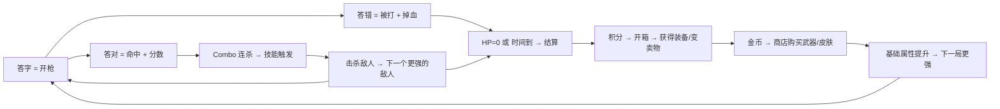

# 🎮 识字大作战 — 游戏设计文档 (GDD)

## 一句话定义

> 一款伪装成射击吃鸡的识字游戏：答字就是开枪，连对就是连杀，每局20分钟打分数、开箱攒装备。替代和平精英/三角洲的游戏时间。

---

## 核心信息

| 维度 | 设计 |
|------|------|
| 目标用户 | 7-8岁，小学1-2年级 |
| 痛点 | 孩子沉迷和平精英/三角洲，需将游戏时间转化为学习 |
| 平台 | 网页（Replit 部署），移动端优先 |
| 技术 | HTML + CSS + Vanilla JS，无后端，localStorage 存档 |
| 单局时长 | 20 分钟 |
| 字库来源 | 人教版/部编版 1-3 年级课本生字表，按学期分6档 |

---

## 核心循环



---

## 局内玩法

### 答题模式（4种轮换，防蒙猜）

| 模式 | 呈现 | 包装 |
|------|------|------|
| 👁️ 看字选音 | 显示汉字 → 选拼音 | 普通子弹 |
| 👂 听音选字 | 播音 → 从形近字中选 | 声波弹 |
| 🖼️ 看图选字 | 显示图片 → 选字 | 瞄准镜 |
| ✍️ 笔画确认 | 答对后追问笔画数 | 暴击确认 |

### Combo 系统

| 连对 | 奖励 |
|------|------|
| 3 | 连杀！伤害x2 |
| 5 | 超神！触发技能 |
| 10 | 大杀特杀！本局金币翻倍 |
| < 2秒答对 | 爆头！额外50%分数 |

### 惩罚系统

| 触发 | 效果 |
|------|------|
| 答错1次 | 掉1格血 |
| 连错2次 | 武器卡壳3秒 |
| 连错3次 | 空袭警告，5秒内答对续命 |
| HP归零 | 本局结束 |
| 正确率<50% | 局后金币减半 |

---

## 局外经济

```
得分 → 金币 + 宝箱
         ↓
    开箱（铜/银/金/传说）
         ↓
    获得装备 → 重复的可变卖
         ↓
    金币 → 商店买武器/皮肤/修理
         ↓
    基础属性提升
```

### 商店

| 类别 | 示例 | 价格 |
|------|------|------|
| 武器 | 手枪→步枪→狙击→火箭 | 免费→500→2000→5000 |
| 皮肤 | 角色外观 | 500-3000 |
| 消耗品 | 修理包、双倍药水 | 100-200 |

### 装备磨损

武器有耐久度，每局消耗，需金币修理 → 持续消耗驱动持续学习。

---

## 长线系统

| 系统 | 设计 |
|------|------|
| 段位 | 青铜→白银→黄金→铂金→钻石→大师→传说 |
| 每日任务 | 3个/天（轮数、准确率、combo、答字量） |
| 错字本Boss | 每日错字生成Boss关，打败领奖 |
| 成就 | 百发百中、武器大师等收集成就 |
| 家长面板 | 学习时长、薄弱字、准确率趋势（密码保护） |

---

## 防蒙猜三层防线

| 层 | 机制 |
|----|------|
| 1. 形近字干扰 | 选项全用形近字（大→太/犬/天），4-6个选项 |
| 2. 多模态轮换 | 看字选音 / 听音选字 / 看图选字 / 笔画确认 |
| 3. 后台检测 | 秒答不计分 / 连快触发冷却 / 波动切题型 / 连错教学 |

---

## 关键设计原则

1. **游戏优先** — 外观和手感必须像真游戏，不能像教育app
2. **军事暗色系** — 深色背景 + 霓虹强调色，对标射击游戏审美
3. **汉字大且清晰** — 48px+，用 Noto Sans SC
4. **即时反馈** — 每次答题都有音效+动画
5. **移动端适配** — 大按钮（48px+），支持竖屏横屏
